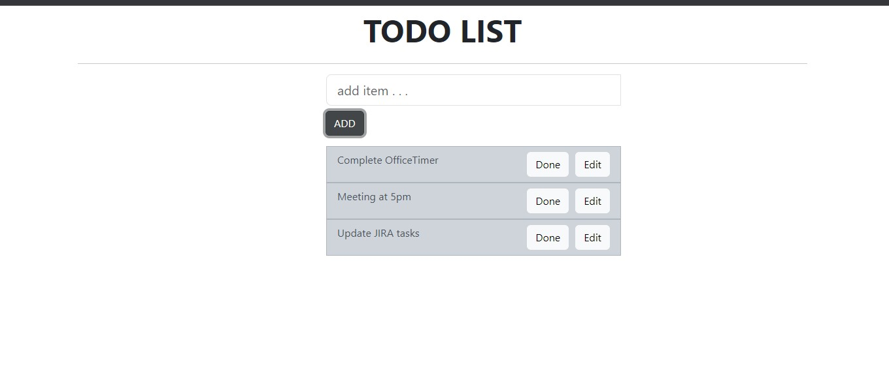

# To-Do App

We will develop a task management application to grasp the fundamentals of ReactJS. Our focus will be on utilizing class-based components, and for styling, we'll employ the React-Bootstrap module. This task manager allows us to both add new tasks and remove existing ones through user interaction. The deletion functionality is achieved by implementing a click event handler, which removes tasks from the list when clicked


## Get Started

After cloning the repository. Install todo-react app with npm

NPX: It is a package runner tool that comes with npm 5.2+, npx is easy to use CLI tools. The npx is used for executing Node packages.

```bash
  npm create-react-app todo-react
  cd todo-react
  
  npm install bootstrap
  npm install react-bootstrap

  npm start
```
